# The index page of all my repositories. 👋

    
    
      

> Back-end: Python, C, Go (with some Java, MATLAB, C++)

> Front-end: HTML, CSS, Vanilla JS (with some Vue)

<!-- 
 -->

---

## Pins

- [**LocalTransfer**](https://github.com/Illusionna/LocalTransfer) (_`Public`_) A fast cross-platform HTTP file server 轻量小巧快速上手的跨平台 HTTP 文件服务器软件
- [**TCPer**](https://github.com/Illusionna/TCPer) (_`Public`_) A Cross-Platform File Transmission Tool 基于 TCP 协议的跨操作系统平台传输工具
- [**HashMap.c**](https://github.com/Illusionna/HashMap.c) (_`Public`_) A type-safe generic `HashMap` table for C11 · 为 C11 打造的通用哈希表

## List

- [**cerveur**](https://github.com/Illusionna/cerveur) (_`Fork`_) A HTTP Web Server Framework Written In C (Just For Fun)
- [**Codes**](https://github.com/Illusionna/Codes) (_`Public`_) 本科课程涉及到杂七杂八的代码，包括 LaTeX、C++、Matlab、Python、SQL Server
- [**ComputerVision**](https://github.com/Illusionna/ComputerVision) (_`Public`_) Efficient ViT and Siamese Network 孪生网络和 ViT 网络训练、测试、预测代码
- [**cryptography.github.io**](https://github.com/Illusionna/cryptography.github.io) (_`Public`_) Cryptography Algorithms 一些加密算法，包括 MD5、DES、AES、RSA、ECC、SHA-1、SHA2-256、SHA3-256、Xoodyak
- [**DesktopGo**](https://github.com/Illusionna/DesktopGo) (_`Public`_) Screen Shared via Socket 快速共享桌面屏幕，通过浏览器观看
- [**Diagrams**](https://github.com/Illusionna/Diagrams) (_`Public`_) 杂七杂八的直链图床
- [**Illusionna.github.io**](https://github.com/Illusionna/Illusionna.github.io) (_`Public`_) Redirect to my GitHub Pages 重定向到 [**`Orzzz.net`**](https://www.orzzz.net) 主页
- [**iQQbot**](https://github.com/Illusionna/iQQbot) (_`Public`_) 一个 HTTP 事件上报的 QQ 机器人框架
- [**LocalTransfer**](https://github.com/Illusionna/LocalTransfer) (_`Public`_) A fast cross-platform HTTP file server 轻量小巧快速上手的跨平台 HTTP 文件服务器软件
- [**NEUmail**](https://github.com/Illusionna/NEUmail) (_`Public`_) Batch Download Email Attachments via POP3/IMAP 批量下载 QQ、163 等邮箱附件
- [**NEUmail-Homepage**](https://github.com/Illusionna/NEUmail-Homepage) (_`Public`_) NEUmail Website 工具主页
- [**Ollava**](https://github.com/Illusionna/Ollava) (_`Public`_) 本科毕业设计，基于 Ollama 和 CLIP 大模型技术，构建 RAG 检索和图片搜索的软件
- [**plt.c**](https://github.com/Illusionna/plt.c) (_`Public`_) Draw the function graph using the C language (just for fun) 用 C 语言绘制函数图像
- [**PMail**](https://github.com/Illusionna/PMail) (_`Fork`_) A Personal Domain Email Server 个人域名邮箱服务器
- [**Read-the-Docs**](https://github.com/Illusionna/Read-the-Docs) (_`Public`_) 数值分析插值、多元统计分析马尔可夫链
- [**redirect.c**](https://github.com/Illusionna/redirect.c) (_`Public`_) A cross-platform HTTP redirect service in order to implement URL short link 支持 Windows 和 Linux 的 HTTP 短链接重定向器
- [**Subjects**](https://github.com/Illusionna/Subjects) (_`Private`_) 本科杂七杂八的学科资料
- [**TCPer**](https://github.com/Illusionna/TCPer) (_`Public`_) A Cross-Platform File Transmission Tool 基于 TCP 协议的跨操作系统平台传输工具
- [**Tiny-Markdown-Editor**](https://github.com/Illusionna/Tiny-Markdown-Editor) (_`Public`_) A Markdown editor created using the `libwebui` static library in C language 使用 C 语言 `libwebui` 静态库构建微型 Markdown 编辑器
- [**tiny-stats**](https://github.com/Illusionna/tiny-stats) (_`Public`_) A statistical library implemented in C language, including Independent Samples T-test and Neural Network BP Classification, etc. 用 C 语言实现的统计算法，包括独立样本 $t$ 检验、BP 神经网络分类等
- [**TinyCC-Runtime**](https://github.com/Illusionna/TinyCC-Runtime) (_`Public`_) Add Useful Libraries to Tiny C Compiler 给 TCC 编译器内置新的运行时 `.h` 头文件
- [**TinyCThread-Tutorial**](https://github.com/Illusionna/TinyCThread-Tutorial) (_`Private`_) A Tutorial for Multi-threading in C Programming Language 跨平台的 C 语言多线程教程，包括线程、互斥锁，可使用支持 C99 的 TCC 编译
- [**UCAS-Homework**](https://github.com/Illusionna/UCAS-Homework) (_`Public`_) 中国科学院研究生一年级北京集中教学课程的杂七杂八作业
- [**UDPer**](https://github.com/Illusionna/UDPer) (_`Public`_) A transmission application by UDP 基于 UDP 协议实现一个可靠传输机制的工具
- [**VisionTransformer**](https://github.com/Illusionna/VisionTransformer) (_`Public`_) Efficient ViT Extension Experiment 在血细胞、水果、猫狗图片集上的扩展实验
- [**webui**](https://github.com/Illusionna/webui) (_`Fork`_) A C Programming Language GUI Framework 使用 Web 浏览器或 WebView 的 C 语言 GUI 框架
- [**zipng**](https://github.com/Illusionna/zipng) (_`Public`_) Minimalist program and efficient compression for PNG 高效压缩 PNG 图片的工具
